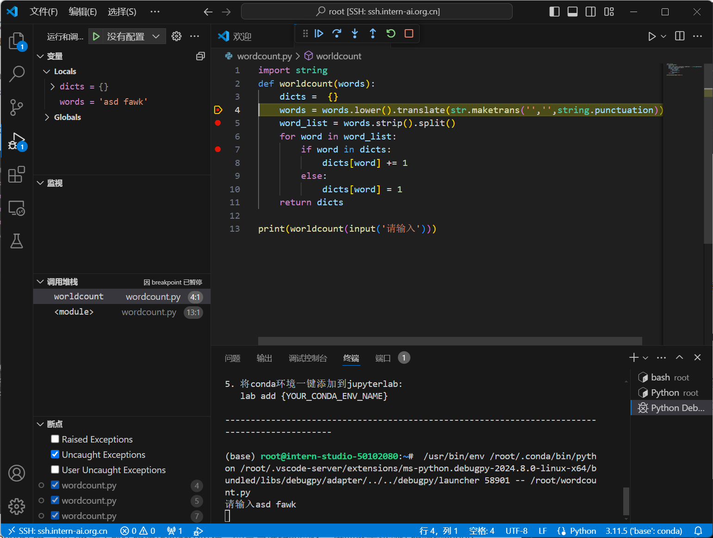

# 闯关任务:Python实现wordcount
代码实现如下

    import string
      def worldcount(words):
        dicts =  {}
        words = words.lower().translate(str.maketrans('','',string.punctuation))
        word_list = words.strip().split()
        for word in word_list:
          if word in dicts:
            dicts[word] += 1
        else:
            dicts[word] = 1
        return dicts
  print(worldcount(input('请输入:')))

# 闯关任务：Vscode连接InternStudio debug笔记
如图进行代码调试

